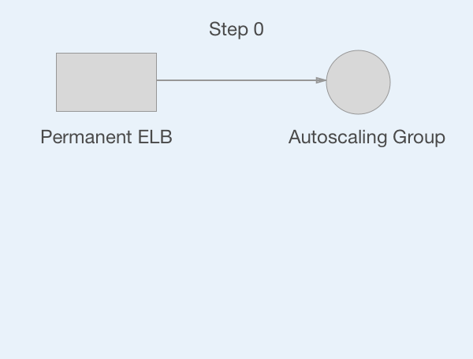
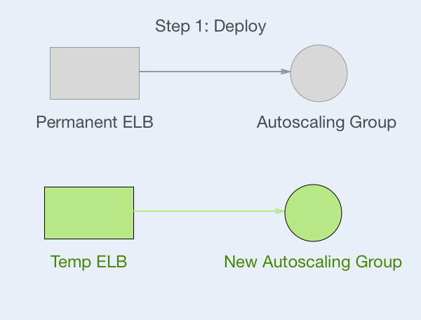
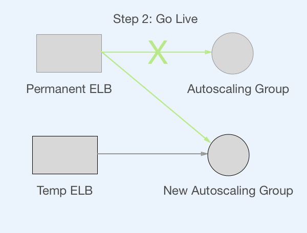
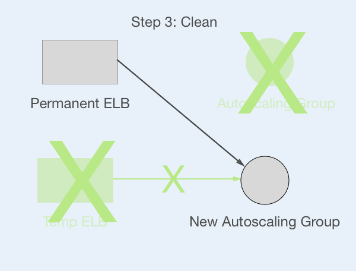

# ansible-swap-deploy


The temp ELB is placed in the same subnet as the new ASG, asg_deploy_asg_vpc_zone_identifier

# Example

```
---

# task/deploy.yml -e stack=streetjumpers -e component=rails -e sha=1a1f1ad573101e834d4f6c895650f4f82a03f071 -e env=dev -e layer=app
#
# When done, the AMI matching stack:streetjumpers, component:rails, at that sha, will be instantiated in to env $env as a layer $layer

- name: deploy layer
  hosts: tag_Env_admin,&tag_Layer_stackstorm
  # for workstation use:
  become: yes
  become_user: deploy

  pre_tasks:
    - include_vars: ../default/account/vars.yml
    - include_vars: ../default/environments/{{ env }}/env.yml
      tags: always

    - name: find AMI from sha
      ec2_ami_find:
        owner: self
        ami_tags:
          Stack:         "{{ stack  }}"
          Type:          'code'
          Component:     "{{ component }}"
          GitSHA:        "{{sha}}"
        region: "{{ aws_region }}"
        no_result_action: fail
        sort: name
        sort_order: descending
        sort_end: 1
      register: ami_from_sha
    - name: set AMI id as fact
      set_fact:
        new_ami_id: "{{ami_from_sha.results[0].ami_id}}"

    - name: set fact
      set_fact:
        layer_config: "{{stacks.streetjumpers.layers.app}}"

  roles:

    - role: reactiveops.get-vpc-facts-master

    - role: reactiveops.ansible-swap-deploy
      deploy: yes
      golive: yes
      clean: yes

      asg_deploy_image_id:                          "{{ new_ami_id }}"
      asg_deploy_env:                               "{{ env }}"

      asg_deploy_layer:                             "{{ layer }}"
      asg_deploy_stack_elbs:                        "{{ layer_config.elb_name }}"
      asg_deploy_stack:                             "{{ stack }}"
      asg_deploy_name:                              "{{ layer_config.deploy_name }}"
      asg_deploy_temp_elb_health_check_ping_port:   "{{ layer_config.temp_elb_health_check_ping_port }}"
      asg_deploy_temp_elb_security_group_ids:       "{{ hostvars[inventory_hostname][env + '_presentation' ] }}"
      asg_deploy_lc_default_instance_size:          "{{ layer_config.instance_type }}"
      asg_deploy_asg_vpc_zone_identifier:           "{{ layer_config.asg_vpc_zone_identifier }}"
      asg_deploy_lc_security_groups:                "{{ hostvars[inventory_hostname][env + '_application' ] }}"
      asg_deploy_lc_instance_profile_name:          'dev_streetjumpers_app'
      asg_deploy_post_instantiantion_playbook_path: "{{ layer_config.asg_deploy_post_instantiantion_playbook_path  }}"
      asg_deploy_asg_availability_zones:            "{{ layer_config.asg_availability_zones }}"
      asg_deploy_asg_health_check_period:           "{{ layer_config.asg_health_check_period }}"
      asg_deploy_asg_health_check_type:             "{{ layer_config.asg_health_check_type }}"
      asg_deploy_asg_replace_all_instances:         "{{ layer_config.asg_replace_all_instances }}"
      asg_deploy_asg_replace_batch_size:            "{{ layer_config.asg_replace_batch_size }}"
      asg_deploy_asg_min_size:                      "{{ layer_config.asg_min_size }}"
      asg_deploy_asg_max_size:                      "{{ layer_config.asg_max_size }}"
      asg_deploy_asg_desired_capacity:              "{{ layer_config.asg_desired_capacity }}"

```


# Sequence

Initial setup



Step 1



Step 2



Step 3


